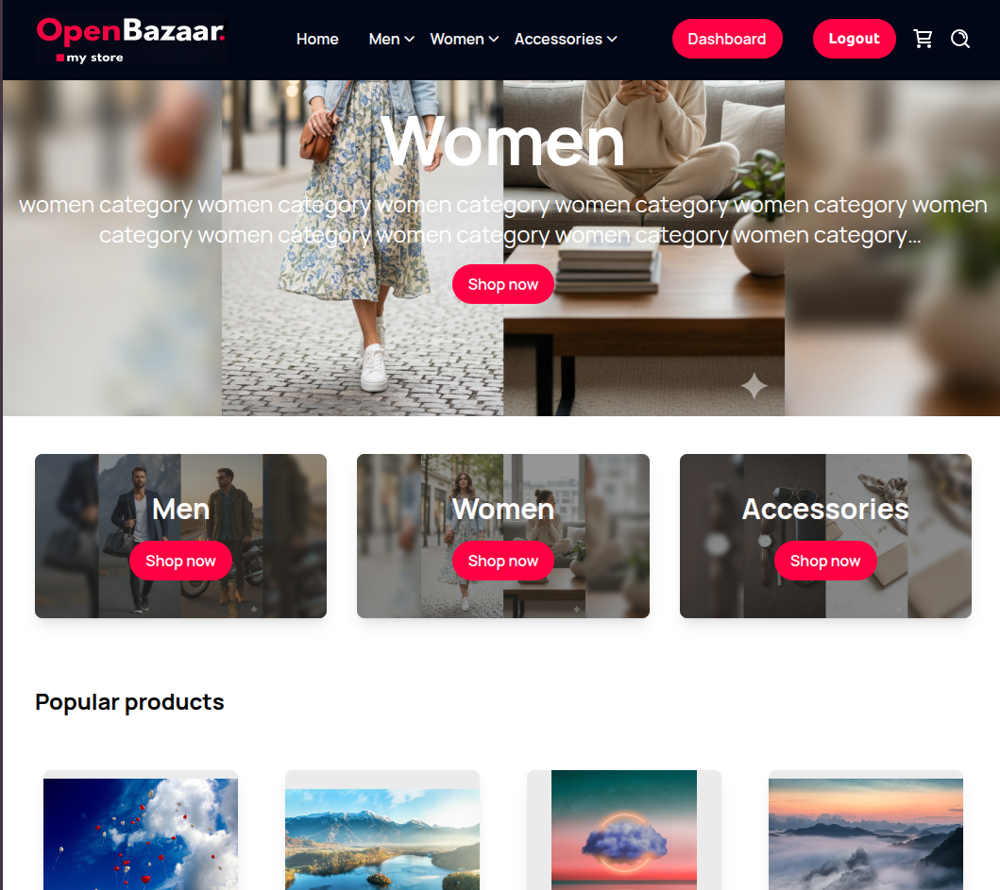
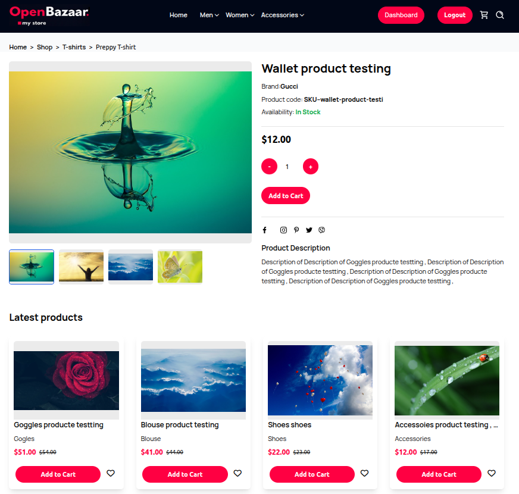
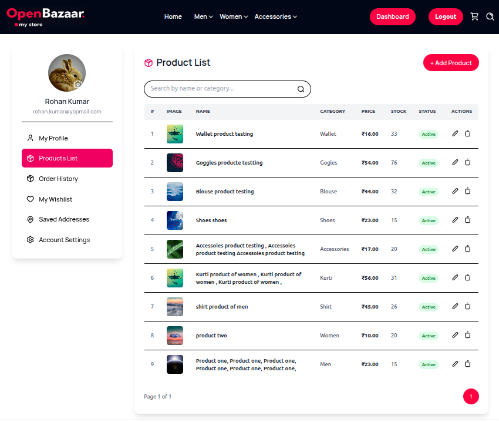

# 🛍️ Open Bazaar (Mini E-commerce Store)

A fully functional e-commerce platform built with **Django**, **MySQL**, and **Tailwind CSS**, designed to simulate a complete online store experience.  
This project demonstrates a practical, full-stack implementation of modern e-commerce features — including authentication, cart/wishlist, checkout with **Stripe**, and media storage using **Cloudinary**.

---

## 🚀 Features

### 🧩 Core Functionality
- **Product Management:** Add, edit, delete, and list products with multiple images.  
- **Product Filtering:** Browse products by category, brand, size, color, and price range.  
- **Dynamic Landing Page:** Displays featured categories, banners, popular & latest products.  
- **Product Details Page:** Includes multiple images, price, description, and related product slider.

### 👥 User Roles
- **Admin:** Manages categories, brands, sizes, colors, and user roles (can assign seller access).  
- **Seller:** CRUD operations for their own products, with dashboard analytics.  
- **Customer:** Can browse, wishlist, add to cart, checkout, and manage orders.

### 💳 Orders & Payments
- Secure **Stripe integration** for order payment.  
- Order summary with subtotal, tax, and shipping charges.  
- Order history and detailed view per user.

### 🖼️ Media & Cloud Integration
- Integrated **Cloudinary** for image storage (products, profile pictures, banners).  
- Automatic handling of multiple uploads and secure media URLs.

### 🧑‍💻 User Dashboard
- Personalized dashboard with order stats, cart count, wishlist, and recent activity.  
- Profile management with editable personal info and password update.

### 🛠️ Tech Stack
- **Backend:** Django 5+, Python 3.x  
- **Frontend:** Tailwind CSS (utility-first responsive design)  
- **Database:** MySQL  
- **Payments:** Stripe API  
- **Media Storage:** Cloudinary  
- **Environment:** Virtualenv / pipenv  
- **Deployment Ready:** Configurable for Render, Railway, or any Django-supported host.

---

## 📸 Screenshots

| Landing Page | Product Page | Dashboard |
|---------------|---------------|------------|
|  |  |  |

---

## ⚙️ Installation & Setup

### 1️⃣ Clone the Repository
```bash
git clone git@github.com:lnarayan-main/django-ecommerce-store-app.git

---
## 🌐 Live Demo
🔗 [Open Bazaar Live](https://open-bazaar.onrender.com/)  
💻 [GitHub Repository](https://github.com/lnarayan-main/django-ecommerce-store-app)

## 👨‍💻 Author
**Laxmi Narayan** — [LinkedIn](https://www.linkedin.com/in/lnlaxminarayan/)